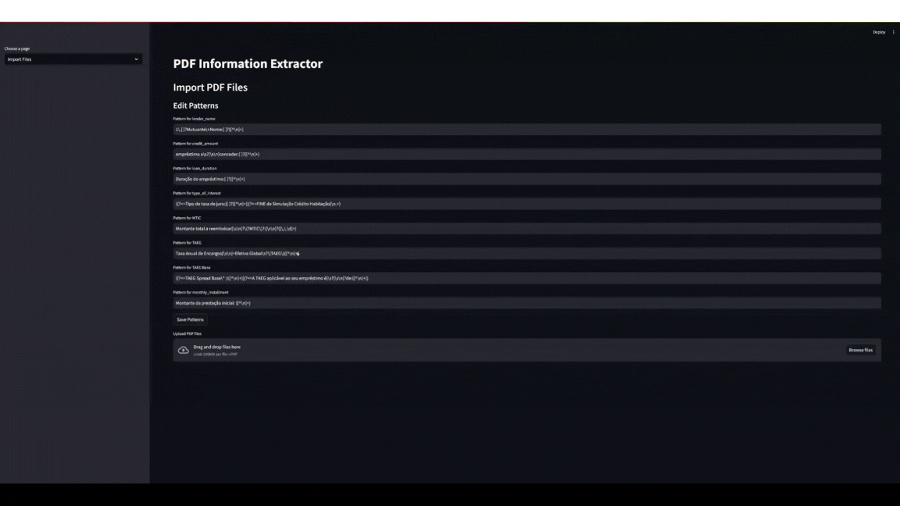

# esis-data-extractor-pt
 

A streamlined PDF data extraction tool specifically designed to process and analyze ESIS (European Standardised Information Sheet) documents from Portuguese banking institutions.

This application automates the extraction of standardized information from ESIS documents, following EU banking regulations for loan proposals.



## Features

- PDF text extraction and processing
- Pattern-based information extraction using regular expressions
- Database storage for extracted data and raw text
- Web-based interface for file management and data visualization
- Export functionality to CSV format
- Pattern management and reevaluation capabilities

## Tech Stack

- Python 3.6+
- Streamlit for web interface
- SQLite for data storage
- PyPDF2 for PDF processing
- Pandas for data manipulation
- Regular expressions for pattern matching

## Installation

1. Clone the repository:
```git
git clone https://github.com/yourusername/esis-data-extractor-pt.git
cd esis-data-extractor-pt
```


3. Install dependencies:
```
pip install streamlit PyPDF2 pandas
```


## Usage

1. Start the application:
```
streamlit run app.py
```


2. Navigate to the web interface, which offers three main pages:
- **Import Files**: Upload PDF files and manage extraction patterns
- **View Extracted Data**: Review and export extracted information
- **Reevaluate Patterns**: Modify patterns and reprocess documents

## Configuration

Create a `patterns.json` file in the root directory with your extraction patterns:
```json
{
"field_name": "regex_pattern",
"another_field": "another_pattern"
}
```


## Database Structure

The application uses SQLite with two main tables:
- `extracted_data`: Stores processed information
- `raw_text`: Stores original document text

## Additional Resources
- https://www.handbook.fca.org.uk/handbook/MCOB/5A/Annex1.html#DES62